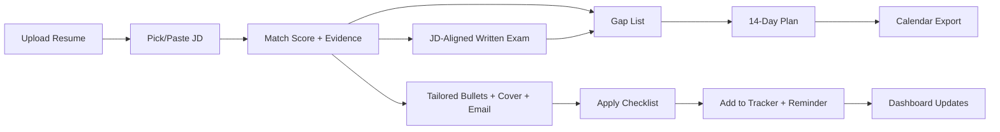
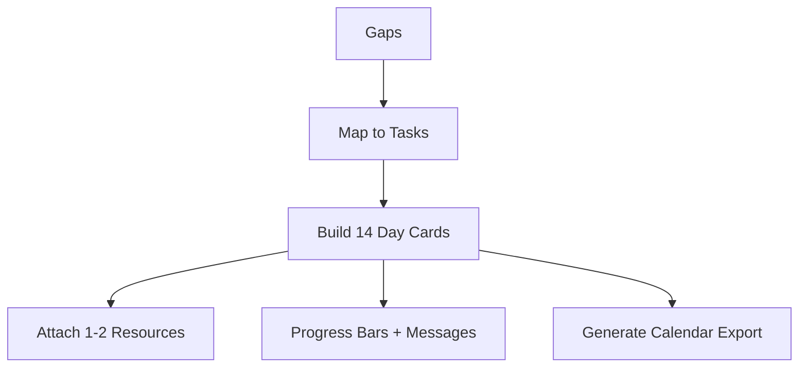
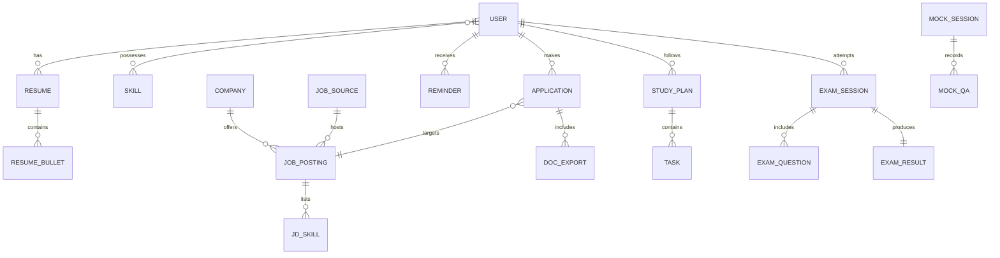

# JobJourney — Project Proposal (Updated)

## 0) Executive Summary

**JobJourney** is a one-stop web app for CS job seekers. Upload your resume, pick target roles, and JobJourney will:

* show how well you match each **job description (JD)**,
* surface **skill gaps**,
* build a **14-day prep plan**,
* generate **tailored bullets, emails, and cover letters**,
* help you **apply and track** every opportunity, and
* (new) run a **JD-aligned written exam (mock-interview style)** to assess you exactly on what that job expects.

We ship a clean **MVP** first (split into **Big Features** and **Small Features**), then expand with **Future Features** after the contest.

---

## 1) Problem & Goals

**Problem:** Job prep is scattered across many tools: resume tweaks, JD matching, coding/system-design practice, behavioral stories, written assessments, and application tracking.
**Goal:** Put the entire journey—**Prepare → Match → Test (written exam) → Tailor → Apply → Track**—in one simple, credible app.

**Success Criteria (MVP):**

* A user completes the full flow in **under 3 minutes** in the demo.
* At least **one multi-step AI flow** runs reliably with clear explanations.
* **JD-aligned written exam** runs end-to-end (create → take → score → review → adds gaps to plan).
* Clear **UI/UX** (empty/loading/error states) and **exports** (PDF/Doc).

---

## 2) Target Users

* **CS students/grads** applying to SWE/Backend/SRE/Data roles.
* **Early-career engineers** polishing resumes and interview skills.
* **Career switchers** who need gap-driven, guided preparation.

---

## 3) MVP — Build These First

### 3.1 Big Features (the “core engines”)

#### BF-1) **JD → Fit → Plan → Apply** (headline AI flow)

**What it does:** From resume + JD, produce **match score**, **evidence view**, **gap list**, a **14-day plan**, and **tailored bullets, cover letter, email**, plus an **apply checklist**.
**Acceptance:** match shown with reasons + evidence; gaps link to tasks; tailored docs cite real resume facts; apply checklist + reminders + export.

---

#### BF-2) **Prep & Learning Engine**

**What it does:** Builds a **14-day plan** (\~10 hrs/week). Each day: **2 coding questions**, **1 tiny system-design task**, **1 quick review**, plus **resources**. Includes CS Fundamentals, DSA, and ML-DL starters with **quizzes**.
**Acceptance:** each task shows which gap it closes; **progress bars** + friendly messages; **calendar export** works.

---

#### 🆕 BF-3) **JD-Aligned Written Exam (Mock-Interview Style)**

**What it does:** Creates a **timed written exam** tailored to a specific **JD** and role level. You answer **short questions, MCQs, small coding snippets, SQL, and one mini system-design prompt**. The app **auto-scores** with a clear **rubric**, gives **per-section feedback**, and **adds weak areas to your gap list and plan**.

**User story:** “I want to test myself on exactly what this JD expects and see where I stand before applying.”

**Modes & Format:**

* **Quick Check (15–20 min):** 8–12 questions (mix of MCQ/short answers/coding snippet).
* **Standard (35–45 min):** 18–25 questions + 1 mini system-design outline.
* **Custom:** pick sections (e.g., Backend + SQL + Docker basics).

**Sections (examples):**

* **Core CS:** data structures, complexity, concurrency basics.
* **Role Skills:** Node/Express, Java/Spring, Python/Django, or SRE/Linux/Docker/K8s, etc.
* **SQL:** joins, indexing, query plans.
* **Coding Snippet:** small function with 2–3 hidden tests (local).
* **System Design Mini:** 8–10 lines: requirements → API sketch → data model.

**Scoring & Feedback:**

* **Auto-score** MCQs and coding tests;
* **Rubric-based** scoring for short/system-design answers (structure, correctness, trade-offs);
* **Section breakdown** (e.g., SQL 6/10, System Design 7/10);
* **Gap injection:** low-scoring topics added to **gap list** → **14-day plan** updates.

**Acceptance:** create → take → auto-score → review report (downloadable) → weak topics flow into the plan. Timer, pause rules, and a simple honor note (“closed-book recommended”) included.

---

#### BF-4) **Applications & Reminders**

Track each opportunity from **Saved → Applied → Phone → Onsite → Offer → Rejected** with **deadlines, notes, attachments**, and **reminders**.
**Acceptance:** update stage/deadlines; set reminders; **calendar file** download; progress UI updates with checklist ticks.

---

#### BF-5) **Tailoring & Docs**

* **Bullet rewriter** (≤ 28 words; quantified; tense-consistent).
* **Email writer** (short, polite mail from JD + profile).
* **Cover letter writer** (120–160 words citing resume facts).
* **Proof/style pass** (grammar/spelling; British/American toggle).
* **PDF/Doc export** with clear filenames.
  **Acceptance:** concise, specific, traceable to resume content; one-click export.

---

### 3.2 Small Features (polish & usability)

#### System & Basics

* **Account & Profile:** roles, seniority, locations, weekly hours, **email notifications**, language (BN/EN).
* **Language & Accessibility:** BN/EN toggle, keyboard-friendly, high contrast, screen-reader labels.
* **Privacy & Safety:** export/delete; HTTPS; **no auto-apply** without review.
* **Helpful Messages:** friendly empty/error/loading states.
* **Dashboard:** today’s tasks, top JD matches, gaps, deadlines, **streak ring**.
* **Settings:** change roles, locations, hours/week, language.

#### Resume, Profile & Portfolio

* **Smart Resume Import** (PDF/Doc/text → editable outline).
* **Resume Checker (simple ATS):** keyword coverage vs JD, clarity flags, section length warnings.
* **Resume ATS Score** (plain guidance).
* **Bullet Rewriter** and **Skill Map** (language/framework/infra/CS + comfort).

#### Job Discovery & Matching

* **Built-in JD Library:** 10–15 sample JDs (SWE, Backend, SRE, Data; junior→senior) available offline.
* **Search Jobs:** find jobs via safe search/APIs (for demo, rely on library + paste).
* **Paste a JD:** clean + dedupe.
* **JD Summary:** “What you’ll do”, “Must-haves”, “Nice-to-haves”, red flags.
* **Match Score**, **Evidence View**, **Gap List**, **Role Template Fallback**.

#### Personalized Prep

* **14-Day Plan** (as BF-2).
* **Gap → Task mapping**, **hand-picked resources** (1–2 per task), **calendar export**.
* **Scoring & Progress Bars** + friendly milestone messages.

#### CS Fundamentals

* **Resource Hub:** curated readings/videos, learning plans, quizzes, PDF summaries.
* **On-Demand:** materials by request on specific topics + quick quizzes.

#### Coding (DSA) Practice

* **Daily Coding Set:** 3 questions/day by pattern (two-pointers, BFS/DFS, DP, greedy) and by topic (number theory, DP, strings, etc.).
* **Pattern Coach:** hints for approach and target complexity.
* **On-Demand resources + quiz** per topic.

#### ML-DL Learning

* **Topic Subsections:** supervised, unsupervised, reinforcement learning (starter).
* **Resources + quiz** per topic.

#### System Design (for interviews)

* **Tiny Design Prompts** (rate limiter, URL shortener, news feed).
* **Answer Scaffold** (requirements → API → data model → scaling → trade-offs).
* **Self-Check List**.

#### Behavioral & Communication

* **STAR Coach** (10 role-specific questions; text/voice → strengths/risks + tighter rewrite).
* **Story Bank** (6–8 reusable stories).

#### Applying & Tracking

* **Application Tracker**, **Apply Checklist**, **Reminders (ICS)**, **progress bars** for checked items.

#### Tailoring & Documents

* **Email Writer**, **Cover Letter Writer**, **Pick Your Bullets**, **Proof/Style**, **PDF/Doc Export**.

#### Explainability

* **Why this score?** evidence view.
* **Why this plan?** each task points to a gap.
* **How it works** diagram (friendly).

---

## 4) Future Features (after MVP)

### 4.1 Tier-1 (Stretch, right after MVP)

* **Notifications:** email/push for deadlines, new matches, today’s tasks.
* **Simple Analytics:** time to first match, plan completion, drill usage, stage conversion.
* **Multiple Resume Versions** (SWE/SRE/Data quick toggle).
* **Achievement Library** (reusable quantified wins).
* **One-Page Portfolio** (auto site from profile JSON).
* **Filters:** remote-OK, visa-friendly, salary band, stack tags.
* **Company Snapshot** (industry/size/stack guess, interview outline).
* **Adaptive Plan** (shuffle missed tasks; keep streaks).
* **Focus Mode** (25/5 timer; time log).
* **In-App Code Editor** (local tests for curated problems in C++/JS/Python).
* **Topic Heatmap** (weak areas feed back to plan).
* **Auto Diagrams** (editable API/ER diagrams).
* **Role Tracks** (SWE-Backend, SRE, Data, Mobile).
* **Mini Tech Labs** (Docker basics, CI, SQL joins, HTTP caching).
* **Recruiter Emails** (short outreach/replies).
* **Clear English Tips** (BN→EN phrasing).
* **Take-Home Support:** brief analyzer, starter kits, time planner.
* **Interview Timeline** (stage-based prep packs).
* **Outcome Analytics** (conversion by role/company; gaps in rejections).
* **Company Tone Presets** (formal/casual/mission covers).
* **Who to Contact** (3 targets + 2 intros each; you supply recipient).
* **Offer Tools:** offer tracker + negotiation helper.
* **Fairness & Safety:** wording guardrails; PII masking default.
* **Motivation:** badges & streaks; progress rings.
* **Browser/Mobile:** share-to-app (mobile), clipboard helper (web).

### 4.2 Tier-2 (Later/Nice-to-Have)

* **Offline/PWA:** view plan and mark tasks without internet; sync later.
* **Integrations:** Google Calendar, Notion export, Drive/Dropbox import.
* **Deeper Analytics:** which content helps most; long-term outcomes.
* **Evidence Attachments:** PRs/demos/reports + PII redaction helper.
* **Location Hints:** Dhaka/Sylhet/Remote; commute considerations.
* **Trusted Job Feeds** (policy-safe; no credential storage).
* **Contest Mode** (timed sets; light penalties).
* **Bug Hunts** (find/fix 3 issues; explain).
* **Rough Cost & Capacity** (basic estimates for designs).
* **Coffee Chat Planner** (agenda + 5 questions; thank-you draft).
* **Relocation & Visa Notes** (general checklists).
* **Peer Challenges** (opt-in, privacy-safe).
* **Cohort Tools** (mentor overviews, shared assignments).
* **Full Installable App** (home-screen, background reminders, richer offline).

---

## 5) User Flows (Mermaid)

### 5.1 End-to-End Demo Flow



### 5.2 Written Exam Flow

```mermaid
flowchart TD
  JD[Choose JD/Role] --> Mode[Choose Mode (Quick/Standard/Custom)]
  Mode --> Build[Generate Exam Sections]
  Build --> Take[Timed Exam UI]
  Take --> Score[Auto-Score + Rubric]
  Score --> Report[Section-wise Feedback + Download]
  Report --> Inject[Add Weak Topics to Gap List]
  Inject --> Plan[Update 14-Day Plan]
```

### 5.3 Prep Engine (Daily Plan)



---

## 6) Data & Architecture

### 6.1 ER Sketch



**Key fields (examples):**

* `USER(locale, roles[], weekly_hours, email_notifications)`
* `RESUME(raw_text, json)`
* `JOB_POSTING(role, level, company, location, jd_text, tags[])`
* `APPLICATION(stage, deadline, notes, attachments[])`
* `EXAM_SESSION(jd_id, mode, started_at, duration_min, score_total, section_scores)`
* `EXAM_QUESTION(session_id, type, prompt, expected, tests[], max_points)`
* `EXAM_RESULT(session_id, report_url, gaps_found[])`
* `STUDY_PLAN(start_date, days=14)` → `TASK(day_idx, type, title, link, done)`
* `DOC_EXPORT(type, url)`

### 6.2 System Diagram

* **Frontend:** React + Vite (i18n, forms, accessibility).
* **Backend:** Node/Express (REST), simple auth.
* **DB:** MongoDB Atlas (great for JSON resumes/plans/exam sessions).
* **Files:** object storage for PDFs and exam reports.
* **AI Orchestration:** multi-step flow (Resume → Match → Written Exam → Plan → Tailor → Apply).
* **Local test runner:** lightweight unit tests for coding snippets inside exams.

---

## 7) Privacy, Security & Safety

* HTTPS; secrets in server env.
* No auto-apply; **human review required**.
* Data export/delete; audit logs for exports.
* PII only in documents you choose to export.
* Written exam: **honor note** (closed-book recommended); timer and limited pausing.

---

## 8) Timeline (Contest Build)

* **Day 1:** UX prototype (7+ screens), Resume→Match→Tailor path, JD library, PDF export.
* **Day 2:** **Written Exam (Quick mode)**, Plan engine, Tracker + Reminders, Explainability modals, polish states, demo script.

---

## 9) Testing & QA

* **Unit:** resume parser, validators, exporter, exam timer/state.
* **Flow tests:** deterministic prompts for match/plan/tailor; exam quick-mode with canned questions.
* **Auto-grading tests:** MCQ correctness; snippet unit tests; rubric checks with gold answers.
* **UX checks:** keyboard-only, screen-reader labels, empty/error states.
* **Acceptance:** full demo path (including a **Quick Written Exam**) runs fast and reliably.

---

## 10) Demo Script (3 minutes)

1. Problem → one-liner.
2. Upload resume → open a JD → show **match score**, evidence, and gaps.
3. **Start Quick Written Exam** (15–20 min mode shown in 20–30 sec): answer 1–2 items → **auto-score** → weak topics appear in gaps.
4. Click **Plan** → 14-day cards → **calendar export**.
5. Click **Tailor** → bullets + cover + email → **PDF export**.
6. Add to **Tracker** → set **reminder** → Dashboard updates.
7. Close with “why this helps” + next steps.

---

## 11) Risks & Mitigation

* **Grading reliability:** combine MCQ + unit-tested snippets + rubric; keep questions specific.
* **Scope risk:** limit exam to **Quick Mode** for MVP; Standard mode later.
* **Inconsistent AI outputs:** constrained prompts and short formats.
* **Time overrun:** ship Big Features first; use seeded JD set.
* **Data/PII:** minimal storage; clear export/delete; no job-site credentials.

---

## 12) Glossary

* **JD:** Job Description (text of a job posting).
* **ATS:** Applicant Tracking System (filters/scans resumes).
* **KSA:** Knowledge, Skill, Ability (items a JD expects).
* **Written Exam:** a **timed, JD-aligned assessment** (MCQ/short answers/code/SQL/system design mini) with auto-scoring and feedback.

---

**JobJourney** now includes a **JD-aligned written exam** that feeds directly into your gap list and plan—so you can test, learn, tailor, and apply in one place. Ready to turn this into the repo README + slides?
